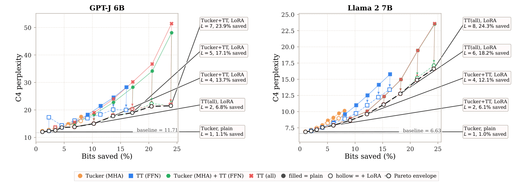

# TT-LLM

[](https://arxiv.org/abs/2606.03465)

*ICML 2026 Workshop on Weight-Space Symmetries · TensorKDD 2026 Workshop*

---

## TL;DR

Tensor decompositions are theoretically elegant but empirically disappointing for post-training LLM compression. We identify a **fundamental mismatch** between the shared-subspace structure assumed by Tucker/TT decompositions and the heterogeneous learned representations in modern LLMs — a gap that LoRA recovery alone cannot reliably close at meaningful compression ratios.




**C4 perplexity vs. compression** for GPT-J 6B and Llama 2 7B across Tucker (MHA), TT (FFN), and combined strategies — with and without LoRA recovery.

---

## Key Insights

- **Subspace mismatch is the core issue.** Tucker and TT decompositions implicitly assume weight matrices share a low-rank latent structure. LLM weights shaped by large-scale heterogeneous training do not satisfy this assumption, and the gap is not a tuning artifact.
- **LoRA recovery is necessary but not sufficient.** Post-decomposition fine-tuning consistently helps, but fails to restore quality beyond ~15% bits saved — the Pareto frontier collapses regardless of decomposition variant.
- **Layer type determines which decomposition fits.** Tucker fits MHA (multi-head attention) blocks better; TT is preferable for FFN. The best Pareto curve comes from mixing: Tucker (MHA) + TT (FFN) + LoRA.
- **MoE models are harder.** Mixture-of-Experts architectures amplify subspace mismatch, further narrowing the practical window for tensorization.

## Repository

```bash
pip install -r requirements.txt
```

Experiments and reproduction scripts are in [`notebooks/`](notebooks/). Core compression utilities are in [`src/`](src/).

| Notebook | What's inside |
|---|---|
| [`merged_tt_tensorllm_experiments.ipynb`](notebooks/merged_tt_tensorllm_experiments.ipynb) | Main experiments: Tucker (MHA) + TT (FFN) + LoRA sweeps, Pareto curves, perplexity evaluation |
| [`tt_superweight_research.ipynb`](notebooks/tt_superweight_research.ipynb) | Analysis of superweight outliers and their effect on TT decomposition quality |
| [`tt_lora_superweight_experiment.ipynb`](notebooks/tt_lora_superweight_experiment.ipynb) | LoRA recovery on a single superweight layer (Llama-2-7B `down_proj`), stage-by-stage PPL tracking |
| [`superweight_layer_restoration_experiments.ipynb`](notebooks/superweight_layer_restoration_experiments.ipynb) | Visualization of superweight restoration across decomposition methods |
| [`dense_sparse_tt_superweight_lora_experiments.ipynb`](notebooks/dense_sparse_tt_superweight_lora_experiments.ipynb) | Dense+sparse TT variant: outlier weights kept exact, inliers compressed, combined with LoRA |
| [`td-moe/`](notebooks/td-moe/) | MoE experiments on GPT-OSS 20B and Qwen3 (scripts, not notebooks) |
